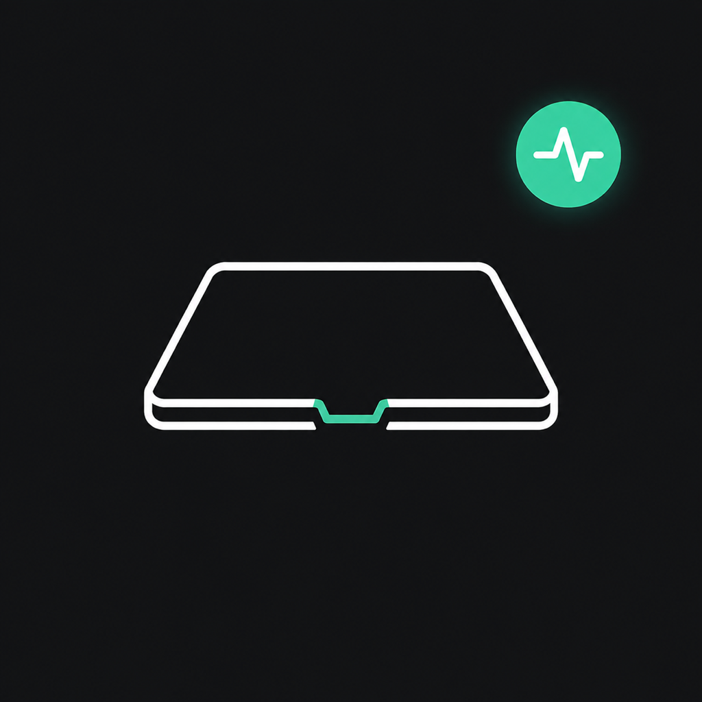

# LidLink · 盒盖在线

<p align="center">
  
</p>

让接通电源的 MacBook 在合盖、关闭内屏后继续运行 Codex、Claude Code、SSH、下载和其他后台任务。

> 非 Apple 或 OpenAI 官方项目。本工具会修改 macOS 的系统睡眠策略，请先阅读安全说明。

## 为什么做这个项目

`caffeinate` 和多数简单防休眠工具只能阻止空闲休眠，macOS 仍可能在 MacBook 合盖时强制睡眠。LidLink 专注于一个保守、明确的使用场景：

- 接通电源时允许合盖继续运行；
- 合盖后主动关闭显示器；
- 拔掉电源后立即恢复正常合盖睡眠；
- 通过菜单栏查看状态和快速恢复；
- 支持登录时启动。

## 工作方式

LidLink 包含两个部分：

1. 原生 AppKit 菜单栏 App：显示供电、盒盖和睡眠状态，保存用户设置。
2. 小型 LaunchDaemon：以固定逻辑监测供电与盒盖状态，并调用 macOS 自带的 `pmset`。

首次安装后台助手时，macOS 会要求管理员授权。之后助手只会在“功能已开启且接通电源”时设置 `disablesleep 1`；拔掉电源、关闭功能或卸载助手时会恢复为 `disablesleep 0`。

## 系统要求

- macOS 13 或更高版本
- 当前预构建版本仅支持 Apple Silicon（arm64）
- MacBook 合盖场景需要接通电源

已在 Apple Silicon MacBook Pro / macOS 26.4.1 上验证。欢迎提交其他机型和系统版本的测试结果。

## 从源码构建

安装 Xcode Command Line Tools，然后运行：

```sh
git clone https://github.com/hzn822-dotcom/LidLink.git
cd LidLink
chmod +x build.sh
./build.sh
```

输出位于 `dist/盒盖在线.app`。将 App 拖入 `/Applications` 后启动。

当前构建使用 ad-hoc 签名，适合本地构建和测试。面向普通用户分发时，应使用 Apple Developer ID 签名并完成 notarization。

## 使用

1. 启动“盒盖在线”，点击菜单栏电脑图标。
2. 勾选“接电时允许合盖在线”。
3. 首次使用时批准安装系统助手。
4. 建议勾选“登录时启动”。
5. 合盖前确认 Mac 已接通电源并保持通风。

本工具只负责让 Mac 保持运行，不提供远程控制服务。远程操作桌面可另行配置 macOS 屏幕共享或可信 VPN；终端任务可使用 SSH。

## 卸载

删除 App 前，先在菜单中选择“卸载系统助手并恢复睡眠…”。这会：

- 将 `SleepDisabled` 恢复为 `0`；
- 停止并删除 `com.codex.lidlink` LaunchDaemon；
- 删除 `/Library/PrivilegedHelperTools/com.codex.lidlink-helper`。

之后再将“盒盖在线.app”移到废纸篓。

## 安全说明

- 切勿在保持运行时将 MacBook 放进电脑包、被褥或其他不通风空间。
- 长时间高负载合盖运行可能导致温度升高和性能限制。
- 拔掉电源后助手会恢复正常睡眠，但仍建议首次使用时亲自验证。
- 后台助手拥有系统权限；请只使用你自己构建或可信发布者签名的版本。
- 合盖时 Apple Silicon/T2 MacBook 的内置麦克风会由硬件断开，这是设备设计，不是本工具故障。

## Roadmap

- [ ] Developer ID 签名和 notarization
- [ ] 温度保护与自动停止
- [ ] 定时保持在线
- [ ] Intel / Universal 2 构建
- [ ] 更完整的自动化测试

## License

[GNU General Public License v3.0 only](LICENSE) (`GPL-3.0-only`).

从本次换证提交开始，修改和再分发版本必须继续采用 GPLv3 并提供对应源码。更早已经按 MIT 发布的提交仍保留其原授权。

---

## English

LidLink is a small native macOS menu bar utility that keeps an AC-powered MacBook running with its lid closed, while turning the display off. Unplugging power immediately restores normal lid-sleep behavior.

It is intended for long-running agent sessions, builds, downloads, SSH, and remote-access workflows. macOS 13+ is required; the current build targets Apple Silicon. This is an unofficial project and is not affiliated with Apple or OpenAI.
